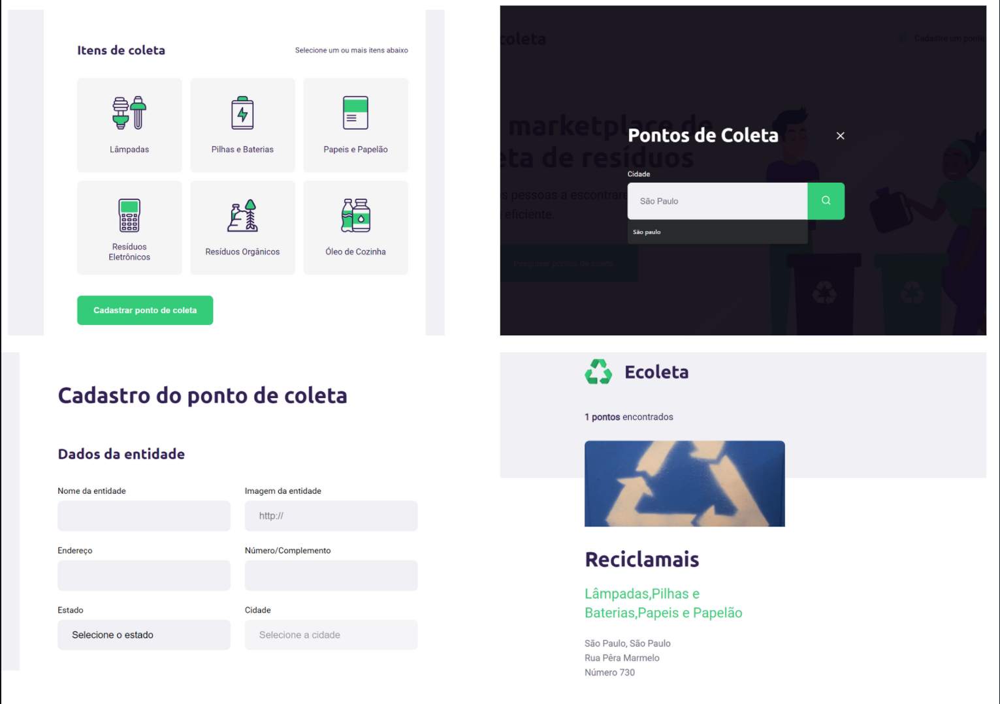

<p align="center">
  

  <a href="https://www.twitter.com/gsabinu/">
    
  </a>
 

  <a href="https://rocketseat.com.br">
    
  </a>
  
  <a href="https://blog.rocketseat.com.br/">
    
    </a>
  
 
</p>
<h1 align="center">
   Next Level Week
</h1>

<h4 align="center"> 
	🚧  Ecoleta ♻️ Concluído 🚀 🚧
</h4>

<p align="center">
 <a href="#-sobre-o-projeto">Sobre</a> •
 <a href="#-funcionalidades">Funcionalidades</a> •
 <a href="#-layout">Layout</a> • 
 <a href="#-como-executar-o-projeto">Como executar</a> • 
 <a href="#-tecnologias">Tecnologias</a> • 
 <a href="#-contribuidores">Contribuidores</a> • 
 <a href="#-autor">Autor</a> • 
 <a href="#user-content--licença">Licença</a>
</p>


## 💻 Sobre o projeto

♻️ Ecoleta - é uma forma de conectar empresas e entidades de coleta de resíduos orgânicos e inorgânicos as pessoas que precisam descartar seus resíduos de maneira ecológica.


Projeto desenvolvido durante a **NLW - Next Level Week** oferecida pela [Rocketseat](https://blog.rocketseat.com.br/primeira-next-level-week/).
O NLW é uma experiência online com muito conteúdo prático, desafios e hacks onde o conteúdo fica disponível durante uma semana.

---

## ⚙️ Funcionalidades

- [x] Empresas ou entidades podem se cadastrar na plataforma web enviando:
  - [x] uma imagem do ponto de coleta
  - [x] nome da entidade, email e whatsapp
  - [x] e o endereço para que ele possa aparecer no mapa
  - [x] além de selecionar um ou mais ítens de coleta: 
    - lâmpadas
    - pilhas e baterias
    - papéis e papelão
    - resíduos eletrônicos
    - resíduos orgânicos
    - óleo de cozinha
    
---
## 🎨 Layout


 Página inicial<p>

</p>

Cadastro e pesquisa de pontos de coleta
<p>

</p>

---

## 🚀 Como executar o projeto

Este projeto é divido em duas partes:
1. Backend (pasta server) 
2. Frontend (pasta web)

💡 O Frontend precisa que o Backend esteja sendo executado para funcionar.

### Pré-requisitos

Antes de começar, você vai precisar ter instalado em sua máquina as seguintes ferramentas:
[Git](https://git-scm.com), [Node.js](https://nodejs.org/en/). 
Além disto é bom ter um editor para trabalhar com o código como [VSCode](https://code.visualstudio.com/)

#### 🎲 Rodando o Backend (servidor)

```bash

# Clone este repositório
$ git clone git@github.com:sabinorush/nlwRocketSeat.git

# Acesse a pasta do projeto no terminal/cmd
$ cd nlwRocketSeat

# Vá para a pasta server
$ cd server

# Instale as dependências
$ npm install

# Execute a aplicação em modo de desenvolvimento
$ npm run dev:server

# O servidor inciará na porta:8080 - acesse http://localhost:8080


```

#### 🧭 Rodando a aplicação web (Frontend)


```bash

# Clone este repositório
$ git clone git@github.com:sabinorush/nlwRocketSeat.git

# Acesse a pasta do projeto no seu terminal/cmd
$ cd nlwRocketSeat

# Vá para a pasta da aplicação Front End
$ cd public

# Instale as dependências
$ npm install

# Execute a aplicação em modo de desenvolvimento
$ npm run start

# A aplicação será aberta na porta:8080 - acesse http://localhost:8080

```

---

## 🛠 Tecnologias

As seguintes ferramentas foram usadas na construção do projeto:

#### **Website**  ([JAVASCRIPT](https://www.javascript.com/)  +  [NODE JS](https://nodejs.org/en/))


> Veja o arquivo  [package.json](https://github.com/sabinorush/nlwRocketSeat/blob/master/package.jsonn)

#### **Server**  ([NodeJS](https://nodejs.org/en/))

-   **[Express](https://expressjs.com/)**
-   **[SQLite](https://github.com/mapbox/node-sqlite3)**


> Veja o arquivo  [package.json](https://github.com/sabinorush/nlwRocketSeat/blob/master/aulas/server/package.json)


## 💪 Como contribuir para o projeto

1. Faça um **fork** do projeto.
2. Crie uma nova branch com as suas alterações: `git checkout -b my-feature`
3. Salve as alterações e crie uma mensagem de commit contando o que você fez: `git commit -m "feature: My new feature"`
4. Envie as suas alterações: `git push origin my-feature`
> Caso tenha alguma dúvida confira este [guia de como contribuir no GitHub](./CONTRIBUTING.md)

---

[](https://twitter.com/Gsabinu) [](https://www.linkedin.com/in/tgmarinho/) 
[](mailto:gu.sabino@hotmail.com)

---

## 📝 Licença

Este projeto esta sobe a licença [MIT](./LICENSE).

Feito com ❤️ por Gustavo Sabino 👋🏽 [Entre em contato!](https://www.linkedin.com/in/gustavo-sabino-21b75a96/)
